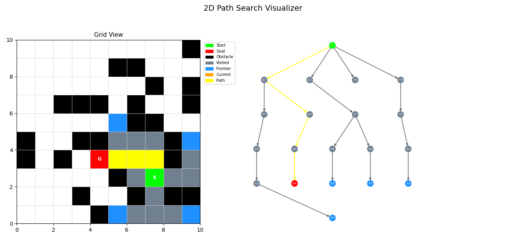
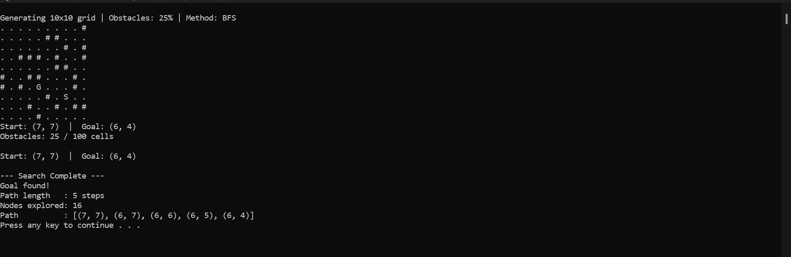

# 2D Path Search Visualizer
### CS449 — Program 1: Part A

A interactive tool that generates a random 2D grid environment and visualizes an uninformed search agent (BFS) navigating from a start node to a goal node in real time.

---

## Project Structure

```
CS449_SearchMethods/
├── main.py           # Entry point — handles user input and wires modules together
├── grid.py           # GridEnvironment class — generates the maze and adjacency graph
├── search.py         # BFS generator and path reconstruction
├── visualizer.py     # Matplotlib visualization — grid view and inverted search tree
├── requirements.txt  # Python dependencies
├── .gitignore        # Ignores __pycache__
└── README.md
```

---

## Requirements

- Python 3.x
- pip

Install dependencies:
```bash
pip install -r requirements.txt
```

If the animation does not run in real time, install tkinter:
```bash
pip install tk
```

---

## How to Run

```bash
python main.py
```

With optional arguments:
```bash
python main.py --rows 10 --cols 10 --obstacles 0.25 --method bfs --speed 0.5
```

| Argument | Default | Description |
|---|---|---|
| `--rows` | 10 | Number of grid rows |
| `--cols` | 10 | Number of grid columns |
| `--obstacles` | 0.25 | Obstacle density (0.20 to 0.30) |
| `--method` | bfs | Search algorithm: `bfs` or `dfs` |
| `--speed` | 0.5 | Seconds between animation frames |

---

## How It Works

### Phase 1 — Grid Generation
- A random NxN grid is generated using numpy
- 20–30% of cells are randomly assigned as obstacles
- Start and goal nodes are placed at random valid (non-obstacle) cells
- A connectivity check ensures the goal is reachable before the search begins
- If the maze is unsolvable it regenerates automatically up to 100 times

### Phase 2 — Agent and Search
- The agent uses **Breadth-First Search (BFS)** — an uninformed search method
- The agent can only move in 4 cardinal directions: North, South, East, West
- The agent cannot move through obstacles
- BFS is implemented as a Python generator, yielding one state snapshot per step so the visualizer can animate each frame
- BFS guarantees the **shortest path** in an unweighted grid

### Phase 3 — Visualization
Two side-by-side subplots update in real time:
- **Left — Grid View:** color coded cells showing obstacles, visited nodes, frontier, current position, and the final path
- **Right — Search Tree:** an inverted tree rooted at the start node, expanding downward as BFS discovers new nodes. The final path is highlighted in yellow.

---

## Color Legend

| Color | Meaning |
|---|---|
| White | Unvisited empty cell |
| Black | Obstacle |
| Green | Start node |
| Red | Goal node |
| Slate Gray | Visited cell |
| Dodger Blue | Frontier (discovered, not yet visited) |
| Orange | Current node being expanded |
| Yellow | Final path |

---

## Output



After the search completes, results are printed to the terminal:

```
--- Search Complete ---
Goal found!
Path length   : 12 steps
Nodes explored: 47
Path          : [(6,6), (6,5), ...]
```

If no path exists:
```
Goal not reachable. No valid path exists.
Nodes explored: 63
```



---

## Dependencies

```
numpy
matplotlib
networkx
```
